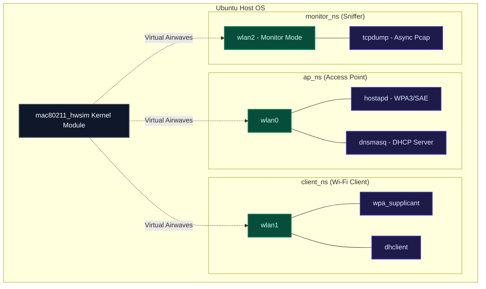

# Automated Regression Testing Framework for Wi-Fi & Network Devices

A lightweight, localized, and high-performance automated testing framework designed to validate Wi-Fi Data Link (L2) and Network (L3) behaviors across simulated firmware updates. 

This framework replaces resource-heavy virtual machines by leveraging Linux Network Namespaces (`netns`) and the kernel's native `mac80211_hwsim` module to execute robust WPA3 authentication, DHCP allocation, and throughput validation tests.

## 🏗️ System Architecture & Topology

The testing topology completely isolates the Access Point, Client, and Packet Sniffer into three distinct network bubbles, utilizing virtual radios linked at the kernel level.



## 🔄 Test Execution Workflow

The framework follows a strict, autonomous pipeline. It builds the network, establishes the baseline connection, executes the test parameters asynchronously, parses the packet captures, and stores the results in SQLite.

```mermaid
sequenceDiagram
    participant Pytest as Pytest Engine
    participant OS as Ubuntu Host
    participant AP as ap_ns (Access Point)
    participant Client as client_ns (Client)
    participant Monitor as monitor_ns (Sniffer)
    participant DB as SQLite / Flask

    Pytest->>OS: Trigger setup_topology.sh
    OS->>AP: Boot hostapd & dnsmasq
    OS->>Client: Boot wpa_supplicant & dhclient
    Client-->>AP: WPA3-SAE Auth & DHCP Request
    AP-->>Client: 192.168.50.x Assigned
    
    rect rgb(30, 41, 59)
        note right of Pytest: Test Execution Block
        Pytest->>Monitor: Spawn async tcpdump
        Pytest->>Client: Execute Test Action (iperf3, wpa_cli)
        Client-->>AP: Transmit Data Payload
        Monitor-->>Pytest: Save artifacts/*.pcap
    end
    
    Pytest->>Pytest: Scapy asserts 802.11/DHCP frames
    Pytest->>DB: Log Execution & Timestamps
    Pytest->>OS: Trigger teardown_topology.sh
    DB->>DB: diff_engine.py checks Regressions
```



## 🚀 Quick Start Guide

### 1. Prerequisites
Ensure you are running an Ubuntu Linux environment with hardware virtualization supported. Install the necessary system dependencies:
```bash
sudo apt-get update
sudo apt-get install -y isc-dhcp-client sqlite3
```

### 2. Python Environment Setup
Isolate the framework dependencies in a virtual environment:
```bash
python3 -m venv wifi-venv
source wifi-venv/bin/activate
pip install -r requirements.txt
```

### 3. Provision the Virtual Hardware
Initialize the Linux network namespaces and load the virtual radios:
```bash
sudo chmod +x scripts/setup_topology.sh
sudo ./scripts/setup_topology.sh
```

### 4. Execute the Test Pipeline
Run the baseline test, simulate a firmware upgrade, and view the automated regression analysis:
```bash
# Initialize database
sqlite3 db/results.db < db/schema.sql

# 1. Run Baseline (Firmware v1.0.0)
python3 -m pytest tests/ -v --fw-version=1.0.0

# 2. Run Upgrade (Firmware v1.0.1)
python3 -m pytest tests/ -v --fw-version=1.0.1

# 3. Analyze Regressions
python3 engine/diff_engine.py 1.0.1
```

### 5. Launch the Dashboard
View historical trends, pass rates, and failure logs via the Flask web portal:
```bash
python3 dashboard/app.py
# Access at [http://127.0.0.1:5000](http://127.0.0.1:5000)
```

### 6. Clean Teardown
To prevent locked virtual hardware or overlapping namespaces after testing, always tear down the environment:
```bash
sudo chmod +x scripts/teardown_topology.sh
sudo ./scripts/teardown_topology.sh
```
