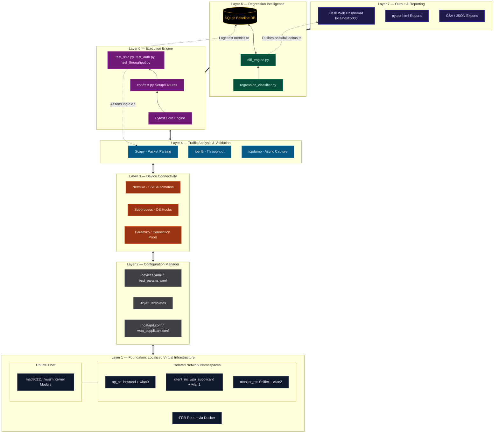

# WiFi Validation Framework

Automated regression testing framework for WiFi and network devices. Runs a full suite of feature tests — DHCP, SSID visibility, WPA2 authentication, DNS, throughput, ping latency, and packet capture — and when a firmware update happens, automatically re-runs those tests and generates a diff report showing exactly what changed in behavior.

Built with **Pytest**, **Netmiko**, **GNS3**, **SQLite**, and **Flask** — mirroring industry-standard network QA practices.

## Architecture


```mermaid
flowchart BT
    %% Styling Definitions
    classDef outputLayer fill:#1e1b4b,stroke:#3730a3,stroke-width:2px,color:#e0e7ff
    classDef intelLayer fill:#064e3b,stroke:#047857,stroke-width:2px,color:#d1fae5
    classDef execLayer fill:#701a75,stroke:#86198f,stroke-width:2px,color:#fae8ff
    classDef trafficLayer fill:#075985,stroke:#0369a1,stroke-width:2px,color:#e0f2fe
    classDef connLayer fill:#9a3412,stroke:#c2410c,stroke-width:2px,color:#ffedd5
    classDef configLayer fill:#3f3f46,stroke:#52525b,stroke-width:2px,color:#f4f4f5
    classDef foundLayer fill:#0f172a,stroke:#334155,stroke-width:2px,color:#f8fafc
    classDef db fill:#000000,stroke:#fbbf24,stroke-width:1px,color:#fbbf24

    %% Layer 7
    subgraph L7 [Layer 7 — Output & Reporting]
        direction LR
        Dashboard[Flask Web Dashboard localhost:5000]:::outputLayer
        HTML[pytest-html Reports]:::outputLayer
        Export[CSV / JSON Exports]:::outputLayer
    end

    %% Layer 6
    subgraph L6 [Layer 6 — Regression Intelligence]
        direction LR
        Diff[diff_engine.py]:::intelLayer
        Baseline[(SQLite Baseline DB)]:::db
        Classifier[regression_classifier.py]:::intelLayer
        
        Diff <--> Baseline
        Classifier --> Diff
    end

    %% Layer 5
    subgraph L5 [Layer 5 — Execution Engine]
        direction LR
        Pytest[Pytest Core Engine]:::execLayer
        Fixtures[conftest.py Setup/Fixtures]:::execLayer
        Tests[test_ssid.py, test_auth.py, test_throughput.py]:::execLayer
        
        Pytest --> Fixtures
        Fixtures --> Tests
    end

    %% Layer 4
    subgraph L4 [Layer 4 — Traffic Analysis & Validation]
        direction LR
        Scapy[Scapy - Packet Parsing]:::trafficLayer
        Iperf[iperf3 - Throughput]:::trafficLayer
        Tcpdump[tcpdump - Async Capture]:::trafficLayer
    end

    %% Layer 3
    subgraph L3 [Layer 3 — Device Connectivity]
        direction LR
        Netmiko[Netmiko - SSH Automation]:::connLayer
        Subprocess[Subprocess - OS Hooks]:::connLayer
        Paramiko[Paramiko / Connection Pools]:::connLayer
    end

    %% Layer 2
    subgraph L2 [Layer 2 — Configuration Manager]
        direction LR
        YAML[devices.yaml / test_params.yaml]:::configLayer
        Jinja[Jinja2 Templates]:::configLayer
        DaemonConfigs[hostapd.conf / wpa_supplicant.conf]:::configLayer
    end

    %% Layer 1
    subgraph L1 [Layer 1 — Foundation: Localized Virtual Infrastructure]
        direction LR
        subgraph Kernel [Ubuntu Host]
            HW[mac80211_hwsim Kernel Module]:::foundLayer
        end
        subgraph Namespaces [Isolated Network Namespaces]
            AP[ap_ns: hostapd + wlan0]:::foundLayer
            Client[client_ns: wpa_supplicant + wlan1]:::foundLayer
            Monitor[monitor_ns: Sniffer + wlan2]:::foundLayer
        end
        Router[FRR Router via Docker]:::foundLayer
        
        Kernel --- Namespaces
    end

    %% Inter-layer Dependencies
    L1 <==> L2
    L2 <==> L3
    L3 <==> L4
    L4 <==> L5
    L5 ==> L6
    L6 ==> L7
    
    %% Specific Cross-Layer Data Flows
    Tests -.->|Asserts logic via| Scapy
    Tests -.->|Logs test metrics to| Baseline
    Diff -.->|Pushes pass/fail deltas to| Dashboard
```

## Quick Start

```bash
# Clone on your Ubuntu VM (after completing INSTALLATION_GUIDE.md)
git clone https://github.com/Nirmal-Yash/wifi-validation-framework.git
cd wifi-validation-framework

# Setup Python environment
python3 -m venv wifi-venv
source wifi-venv/bin/activate
pip install -r requirements.txt

# Update configs/devices.yaml with your lab VM IPs

# Run all tests
pytest tests/ -v --html=results/reports/report.html

# Or use the run script
chmod +x run_all.sh
./run_all.sh
```

## Regression Workflow

```bash
# 1. Run tests on Firmware v1.0 and save baseline
pytest tests/ -v --firmware-version=v1.0
python regression/baseline_runner.py --version v1.0

# 2. Simulate firmware upgrade with deliberate bug
python regression/fw_simulator.py --version v2.0 --bug dns

# 3. Re-run tests on v2.0
pytest tests/ -v --firmware-version=v2.0

# 4. Generate diff report
python regression/diff_engine.py --version v1.0
# Output: results/reports/diff_report.html

# 5. View dashboard
python dashboard/app.py
# Open http://localhost:5000
```

## Test Suite

| Test File | Marker | Validates |
|---|---|---|
| `test_dhcp.py` | smoke | Client VM receives DHCP IP |
| `test_ssid.py` | smoke | Configured SSID visible in scan |
| `test_auth.py` | regression | WPA2 authentication completed |
| `test_dns.py` | smoke | DNS hostname resolution |
| `test_ping.py` | perf | Packet loss and latency thresholds |
| `test_throughput.py` | perf | iperf3 bandwidth above minimum |
| `test_packet_capture.py` | regression | DHCP packets in pcap |
| `test_fault_injection.py` | regression | Link down/up recovery |

Run by marker:

```bash
pytest -m smoke -v        # Quick checks
pytest -m regression -v   # Full regression
pytest -m perf -v         # Performance tests
```

## Project Structure

```
wifi-validation-framework/
├── configs/           # devices.yaml, test_params.yaml, topology.yaml
├── templates/         # Jinja2 router and hostapd config templates
├── lib/               # connector, traffic, capture, db_helper
├── tests/             # Pytest test suite
├── regression/        # baseline, diff engine, fw simulator
├── dashboard/         # Flask web UI (localhost:5000)
├── docs/              # INSTALLATION_GUIDE.md
├── results/           # reports, captures, SQLite DB (gitignored)
├── requirements.txt
├── pytest.ini
└── run_all.sh
```

## Configuration

Edit these files to match your lab:

- **`configs/devices.yaml`** — SSH IPs, usernames, passwords for all VMs
- **`configs/test_params.yaml`** — SSID, thresholds, firmware versions
- **`configs/topology.yaml`** — Lab node layout documentation

## Tech Stack

| Tool | Purpose |
|---|---|
| GNS3 + FRR | Virtual network lab |
| hostapd | Software WiFi access point |
| Netmiko | SSH automation |
| Pytest | Test framework |
| PyShark / tcpdump | Packet capture and analysis |
| iperf3 | Throughput measurement |
| SQLite | Test result storage |
| Flask | Web dashboard |
| Jinja2 | Config template rendering |

## Documentation

- **[Installation Guide](docs/INSTALLATION_GUIDE.md)** — Complete manual setup for Ubuntu VM, GNS3, Docker, hostapd, and lab topology

## Team

| Person | Focus |
|---|---|
| Person A | Lab setup, router config, Netmiko SSH, packet capture |
| Person B | Pytest tests, SQLite, Flask dashboard, reports |

## License

MIT — free for academic and personal use.
